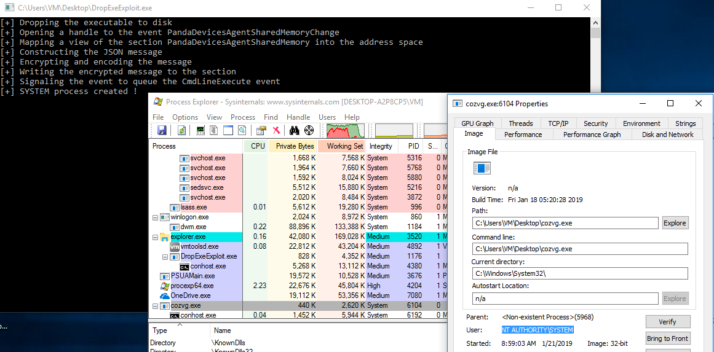

# Panda Antivirus - Local Privilege Escalation (CVE-2019-12042)
This is the exploit for a vulnerability I found in Panda Antivirus leading to escalation of privileges to SYSTEM.

The affected products are : Versions < 18.07.03 of Panda Dome, Panda Internet Security, Panda Antivirus Pro, Panda Global Protection, Panda Gold Protection, and old versions of Panda Antivirus >= 15.0.4.

The issue has been fixed in version 18.07.03.

A compiled x86 exploit can be found under the [bin](bin) directory, it executes as SYSTEM a dummy program that loops indefinitely. The compiled exploit is universal to all Windows versions and to all the products above.

## Technical write-up
https://rce4fun.blogspot.com/2019/05/panda-antivirus-local-privilege.html

#### Poc image (Windows 10 x64)

